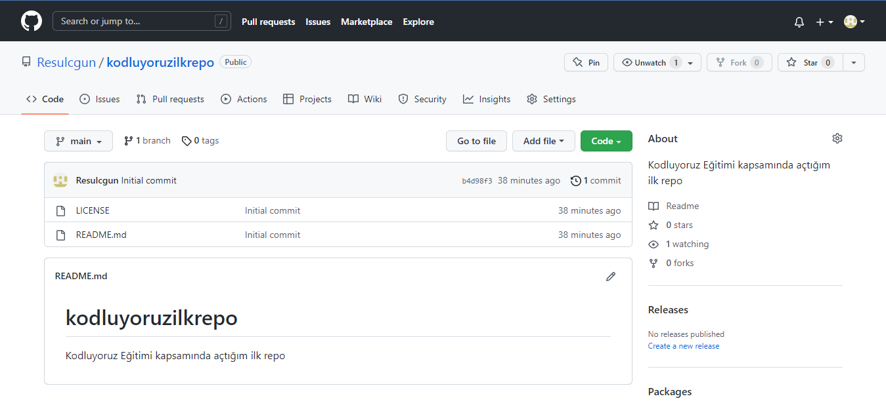

# Kodluyoruz Ilk Repo
Bu repo [Kodluyoruz](https://www.kodluyoruz.org) Front-end Eğitiminde oluşturduğumuz ilk repo. İçerisinde README dosyası, bir adet de index.html barındırıyor.



## Installation
Öncelikler projeyi klonlayın.

```bash
git clone https://github.com/Resulcgun/kodluyoruzilkrepo.git 
```

## Usage
Projeyi klonladıktan sonra Visual Code programıda açınız.

Linux için:
```linux
cd kodluyoruz ilk repo

code .
```

## Contributing

Pull requestler kabul edilir. Büyük değişiklikler için, lütfen neyi değiştirmek istediğinizi tartışmak için bir konu açınız.

## Licence 

[MIT](https://choosealicense.com/licenses/mit/)
